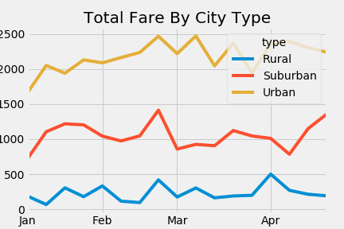
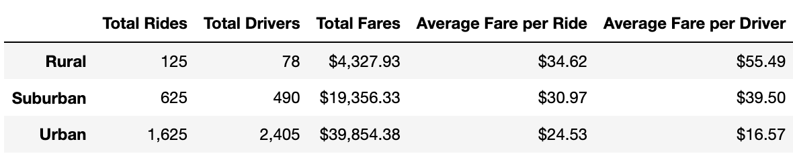

# PyBer Analysis

## Overview of the Analysis

The purpose of this analysis was to create datatables and visualizations based on rideshare data from PyBer, a fictional ridesharing company.  

## Results

Based on the data analysis, we can see that there are more riders in urban areas than in suburban and rural areas, which makes sense. This also results in the total fares being highest in urban areas, as shown by the below chart:

However, looking at the average fare per ride, we see that the rural areas have the highest numbers, followed by suburban and urban areas:

We can also see that the average fare per driver follows a similar pattern, but this may be due to the amount of drivers being highest in urban areas (followed by suburban and then rural areas).

## Summary

Based on these results, there are a few business recommendations we can make:

- Increase the availability of drivers in suburban and rural areas
- Focus more on rural areas as they have the highest average fare per ride
- Lower the rates in rural areas
